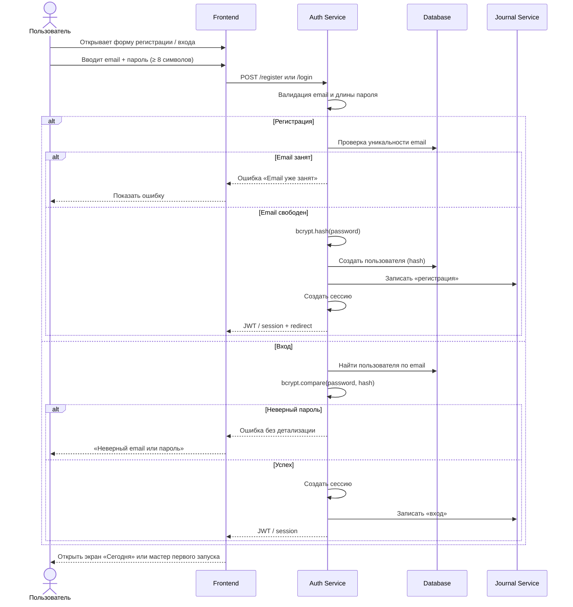

```mermaid
sequenceDiagram
    actor User as Пользователь
    participant FE as Frontend
    participant Auth as Auth Service
    participant DB as Database
    participant Log as Journal Service

    User->>FE: Открывает форму регистрации / входа
    User->>FE: Вводит email + пароль (≥ 8 символов)
    FE->>Auth: POST /register или /login
    Auth->>Auth: Валидация email и длины пароля
    alt Регистрация
        Auth->>DB: Проверка уникальности email
        alt Email занят
            Auth-->>FE: Ошибка «Email уже занят»
            FE-->>User: Показать ошибку
        else Email свободен
            Auth->>Auth: bcrypt.hash(password)
            Auth->>DB: Создать пользователя (hash)
            Auth->>Log: Записать «регистрация»
            Auth->>Auth: Создать сессию
            Auth-->>FE: JWT / session + redirect
        end
    else Вход
        Auth->>DB: Найти пользователя по email
        Auth->>Auth: bcrypt.compare(password, hash)
        alt Неверный пароль
            Auth-->>FE: Ошибка без детализации
            FE-->>User: «Неверный email или пароль»
        else Успех
            Auth->>Auth: Создать сессию
            Auth->>Log: Записать «вход»
            Auth-->>FE: JWT / session
        end
    end
    FE-->>User: Открыть экран «Сегодня» или мастер первого запуска
```