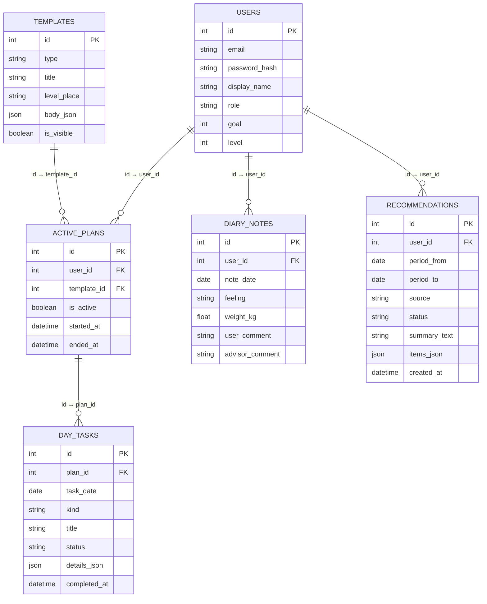

```mermaid
erDiagram
    USERS ||--o{ ACTIVE_PLANS : "id → user_id"
    USERS ||--o{ DIARY_NOTES : "id → user_id"
    USERS ||--o{ RECOMMENDATIONS : "id → user_id"
    TEMPLATES ||--o{ ACTIVE_PLANS : "id → template_id"
    ACTIVE_PLANS ||--o{ DAY_TASKS : "id → plan_id"

    USERS {
        int id PK
        string email
        string password_hash
        string display_name
        string role
        int goal
        int level
    }

    TEMPLATES {
        int id PK
        string type
        string title
        string level_place
        json body_json
        boolean is_visible
    }

    ACTIVE_PLANS {
        int id PK
        int user_id FK
        int template_id FK
        boolean is_active
        datetime started_at
        datetime ended_at
    }

    DAY_TASKS {
        int id PK
        int plan_id FK
        date task_date
        string kind
        string title
        string status
        json details_json
        datetime completed_at
    }

    DIARY_NOTES {
        int id PK
        int user_id FK
        date note_date
        string feeling
        float weight_kg
        string user_comment
        string advisor_comment
    }

    RECOMMENDATIONS {
        int id PK
        int user_id FK
        date period_from
        date period_to
        string source
        string status
        string summary_text
        json items_json
        datetime created_at
    }
```