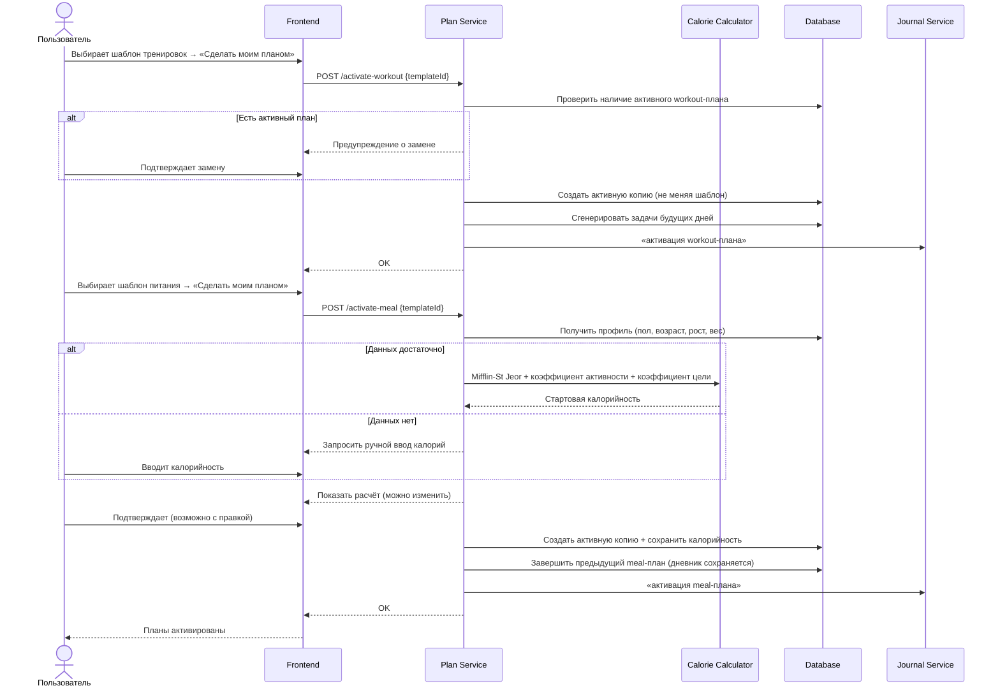

```mermaid
sequenceDiagram
actor User as Пользователь
participant FE as Frontend
participant Plan as Plan Service
participant Calc as Calorie Calculator
participant DB as Database
participant Log as Journal Service


User->>FE: Выбирает шаблон тренировок → «Сделать моим планом»
FE->>Plan: POST /activate-workout {templateId}
Plan->>DB: Проверить наличие активного workout-плана
alt Есть активный план
    Plan-->>FE: Предупреждение о замене
    User->>FE: Подтверждает замену
end
Plan->>DB: Создать активную копию (не меняя шаблон)
Plan->>DB: Сгенерировать задачи будущих дней
Plan->>Log: «активация workout-плана»
Plan-->>FE: OK
User->>FE: Выбирает шаблон питания → «Сделать моим планом»
FE->>Plan: POST /activate-meal {templateId}
Plan->>DB: Получить профиль (пол, возраст, рост, вес)
alt Данных достаточно
    Plan->>Calc: Mifflin-St Jeor + коэффициент активности + коэффициент цели
    Calc-->>Plan: Стартовая калорийность
else Данных нет
    Plan-->>FE: Запросить ручной ввод калорий
    User->>FE: Вводит калорийность
end
Plan-->>FE: Показать расчёт (можно изменить)
User->>FE: Подтверждает (возможно с правкой)
Plan->>DB: Создать активную копию + сохранить калорийность
Plan->>DB: Завершить предыдущий meal-план (дневник сохраняется)
Plan->>Log: «активация meal-плана»
Plan-->>FE: OK
FE-->>User: Планы активированы
```