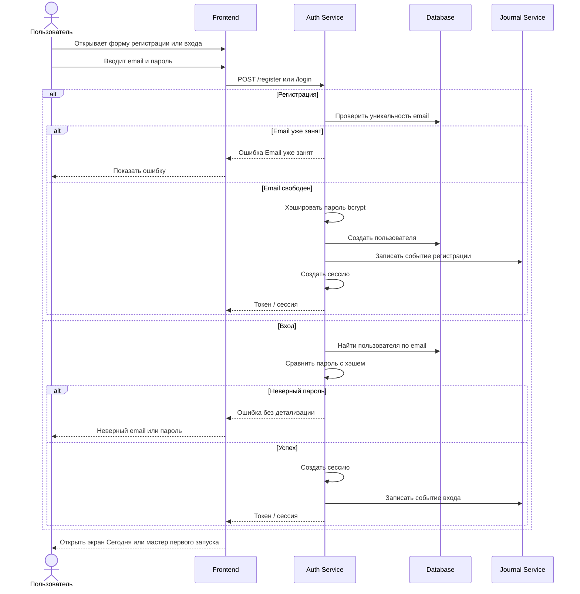

# UC-1. Регистрация и вход

```mermaid
sequenceDiagram
    actor User as Пользователь
    participant FE as Frontend
    participant Auth as Auth Service
    participant DB as Database
    participant Log as Journal Service

    User->>FE: Открывает форму регистрации или входа
    User->>FE: Вводит email и пароль
    FE->>Auth: POST /register или /login

    alt Регистрация
        Auth->>DB: Проверить уникальность email
        alt Email уже занят
            Auth-->>FE: Ошибка Email уже занят
            FE-->>User: Показать ошибку
        else Email свободен
            Auth->>Auth: Хэшировать пароль bcrypt
            Auth->>DB: Создать пользователя
            Auth->>Log: Записать событие регистрации
            Auth->>Auth: Создать сессию
            Auth-->>FE: Токен / сессия
        end
    else Вход
        Auth->>DB: Найти пользователя по email
        Auth->>Auth: Сравнить пароль с хэшем
        alt Неверный пароль
            Auth-->>FE: Ошибка без детализации
            FE-->>User: Неверный email или пароль
        else Успех
            Auth->>Auth: Создать сессию
            Auth->>Log: Записать событие входа
            Auth-->>FE: Токен / сессия
        end
    end

    FE-->>User: Открыть экран Сегодня или мастер первого запуска
```
