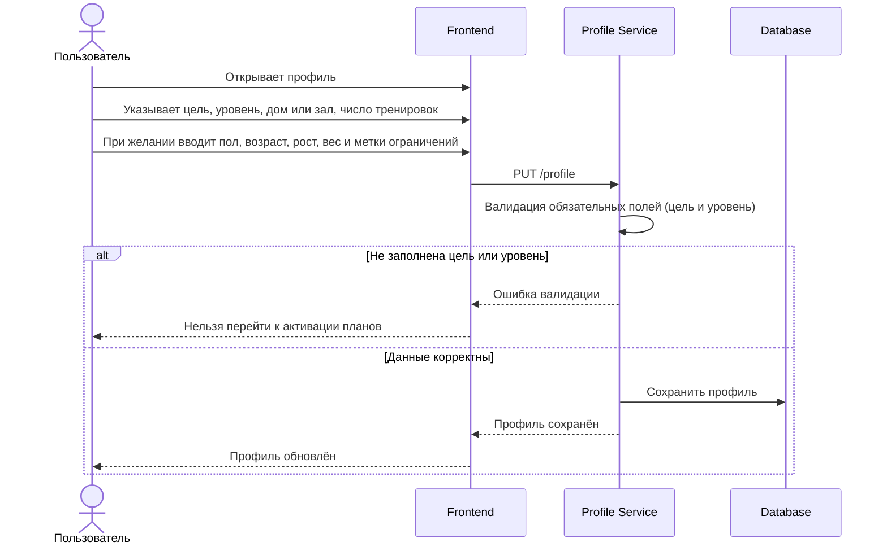

# UC-2. Заполнение профиля и цели

```mermaid
sequenceDiagram
    actor User as Пользователь
    participant FE as Frontend
    participant Profile as Profile Service
    participant DB as Database

    User->>FE: Открывает профиль
    User->>FE: Указывает цель, уровень, дом или зал, число тренировок
    User->>FE: При желании вводит пол, возраст, рост, вес и метки ограничений
    FE->>Profile: PUT /profile
    Profile->>Profile: Валидация обязательных полей (цель и уровень)

    alt Не заполнена цель или уровень
        Profile-->>FE: Ошибка валидации
        FE-->>User: Нельзя перейти к активации планов
    else Данные корректны
        Profile->>DB: Сохранить профиль
        Profile-->>FE: Профиль сохранён
        FE-->>User: Профиль обновлён
    end
```
