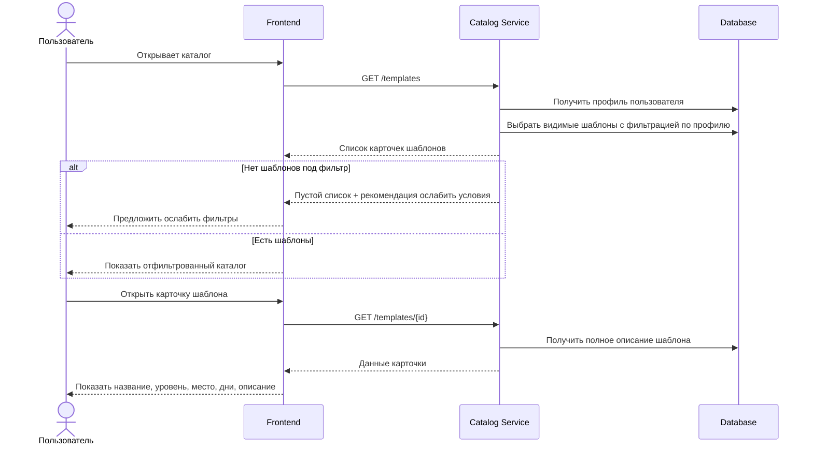

# UC-3. Просмотр каталога планов

```mermaid
sequenceDiagram
    actor User as Пользователь
    participant FE as Frontend
    participant Catalog as Catalog Service
    participant DB as Database

    User->>FE: Открывает каталог
    FE->>Catalog: GET /templates
    Catalog->>DB: Получить профиль пользователя
    Catalog->>DB: Выбрать видимые шаблоны с фильтрацией по профилю
    Catalog-->>FE: Список карточек шаблонов

    alt Нет шаблонов под фильтр
        Catalog-->>FE: Пустой список + рекомендация ослабить условия
        FE-->>User: Предложить ослабить фильтры
    else Есть шаблоны
        FE-->>User: Показать отфильтрованный каталог
    end

    User->>FE: Открыть карточку шаблона
    FE->>Catalog: GET /templates/{id}
    Catalog->>DB: Получить полное описание шаблона
    Catalog-->>FE: Данные карточки
    FE-->>User: Показать название, уровень, место, дни, описание
```
