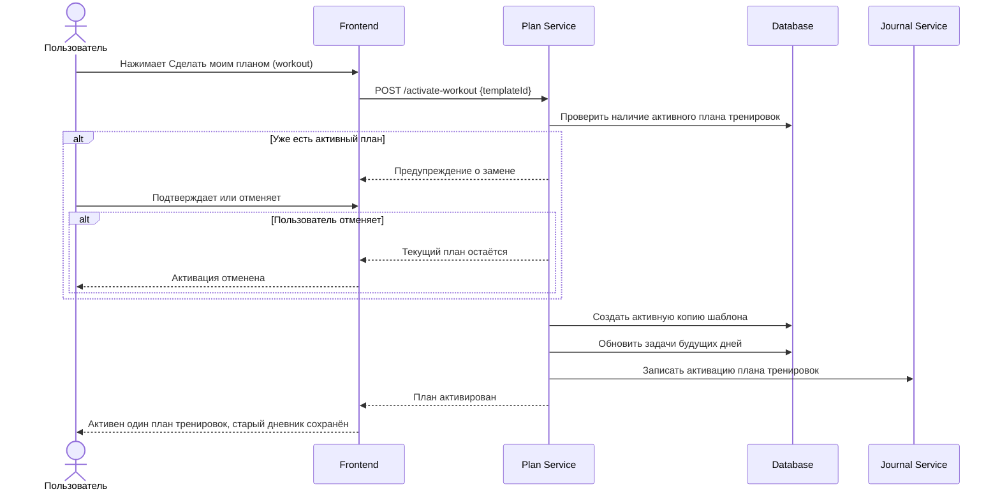

# UC-4. Активация плана тренировок

```mermaid
sequenceDiagram
    actor User as Пользователь
    participant FE as Frontend
    participant Plan as Plan Service
    participant DB as Database
    participant Log as Journal Service

    User->>FE: Нажимает Сделать моим планом (workout)
    FE->>Plan: POST /activate-workout {templateId}
    Plan->>DB: Проверить наличие активного плана тренировок

    alt Уже есть активный план
        Plan-->>FE: Предупреждение о замене
        User->>FE: Подтверждает или отменяет
        alt Пользователь отменяет
            Plan-->>FE: Текущий план остаётся
            FE-->>User: Активация отменена
        end
    end

    Plan->>DB: Создать активную копию шаблона
    Plan->>DB: Обновить задачи будущих дней
    Plan->>Log: Записать активацию плана тренировок
    Plan-->>FE: План активирован
    FE-->>User: Активен один план тренировок, старый дневник сохранён
```
