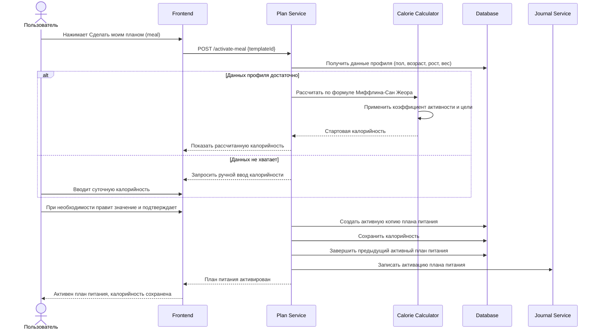

# UC-5. Активация плана питания

```mermaid
sequenceDiagram
    actor User as Пользователь
    participant FE as Frontend
    participant Plan as Plan Service
    participant Calc as Calorie Calculator
    participant DB as Database
    participant Log as Journal Service

    User->>FE: Нажимает Сделать моим планом (meal)
    FE->>Plan: POST /activate-meal {templateId}
    Plan->>DB: Получить данные профиля (пол, возраст, рост, вес)

    alt Данных профиля достаточно
        Plan->>Calc: Рассчитать по формуле Миффлина-Сан Жеора
        Calc->>Calc: Применить коэффициент активности и цели
        Calc-->>Plan: Стартовая калорийность
        Plan-->>FE: Показать рассчитанную калорийность
    else Данных не хватает
        Plan-->>FE: Запросить ручной ввод калорийности
        User->>FE: Вводит суточную калорийность
    end

    User->>FE: При необходимости правит значение и подтверждает
    Plan->>DB: Создать активную копию плана питания
    Plan->>DB: Сохранить калорийность
    Plan->>DB: Завершить предыдущий активный план питания
    Plan->>Log: Записать активацию плана питания
    Plan-->>FE: План питания активирован
    FE-->>User: Активен план питания, калорийность сохранена
```
