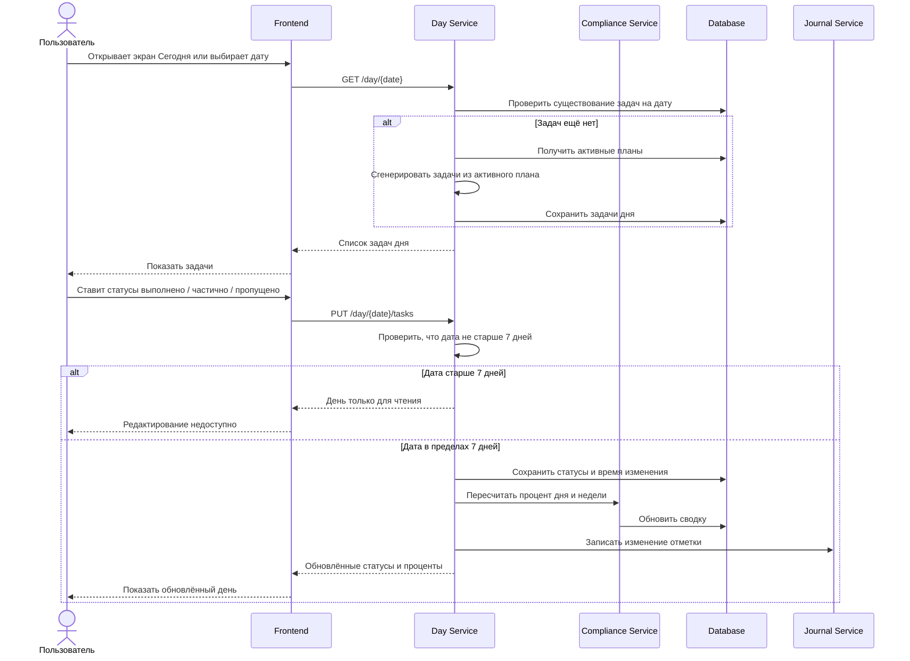

# UC-6. Отметка задач дня

```mermaid
sequenceDiagram
    actor User as Пользователь
    participant FE as Frontend
    participant Day as Day Service
    participant Compliance as Compliance Service
    participant DB as Database
    participant Log as Journal Service

    User->>FE: Открывает экран Сегодня или выбирает дату
    FE->>Day: GET /day/{date}
    Day->>DB: Проверить существование задач на дату

    alt Задач ещё нет
        Day->>DB: Получить активные планы
        Day->>Day: Сгенерировать задачи из активного плана
        Day->>DB: Сохранить задачи дня
    end

    Day-->>FE: Список задач дня
    FE-->>User: Показать задачи

    User->>FE: Ставит статусы выполнено / частично / пропущено
    FE->>Day: PUT /day/{date}/tasks

    Day->>Day: Проверить, что дата не старше 7 дней
    alt Дата старше 7 дней
        Day-->>FE: День только для чтения
        FE-->>User: Редактирование недоступно
    else Дата в пределах 7 дней
        Day->>DB: Сохранить статусы и время изменения
        Day->>Compliance: Пересчитать процент дня и недели
        Compliance->>DB: Обновить сводку
        Day->>Log: Записать изменение отметки
        Day-->>FE: Обновлённые статусы и проценты
        FE-->>User: Показать обновлённый день
    end
```
