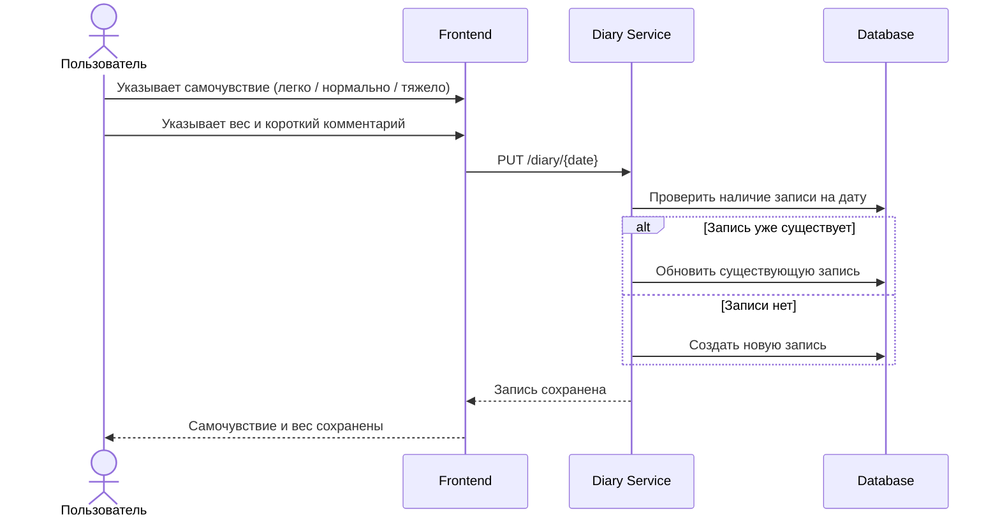

# UC-7. Запись самочувствия и веса

```mermaid
sequenceDiagram
    actor User as Пользователь
    participant FE as Frontend
    participant Diary as Diary Service
    participant DB as Database

    User->>FE: Указывает самочувствие (легко / нормально / тяжело)
    User->>FE: Указывает вес и короткий комментарий
    FE->>Diary: PUT /diary/{date}

    Diary->>DB: Проверить наличие записи на дату
    alt Запись уже существует
        Diary->>DB: Обновить существующую запись
    else Записи нет
        Diary->>DB: Создать новую запись
    end

    Diary-->>FE: Запись сохранена
    FE-->>User: Самочувствие и вес сохранены
```
