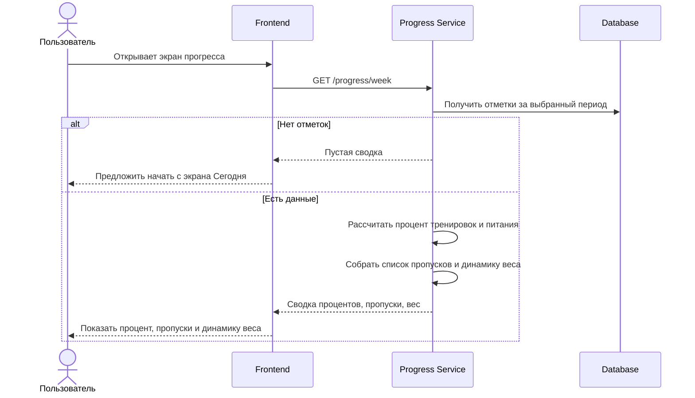

# UC-8. Просмотр прогресса за неделю

```mermaid
sequenceDiagram
    actor User as Пользователь
    participant FE as Frontend
    participant Progress as Progress Service
    participant DB as Database

    User->>FE: Открывает экран прогресса
    FE->>Progress: GET /progress/week
    Progress->>DB: Получить отметки за выбранный период

    alt Нет отметок
        Progress-->>FE: Пустая сводка
        FE-->>User: Предложить начать с экрана Сегодня
    else Есть данные
        Progress->>Progress: Рассчитать процент тренировок и питания
        Progress->>Progress: Собрать список пропусков и динамику веса
        Progress-->>FE: Сводка процентов, пропуски, вес
        FE-->>User: Показать процент, пропуски и динамику веса
    end
```
