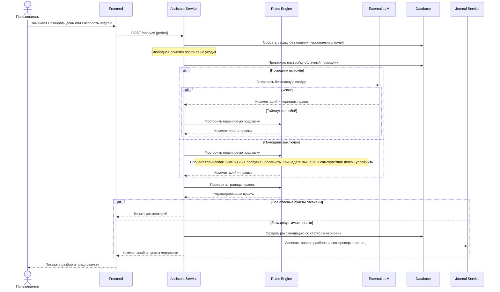

# UC-9. Запрос разбора у помощника

```mermaid
sequenceDiagram
    actor User as Пользователь
    participant FE as Frontend
    participant Assistant as Assistant Service
    participant Rules as Rules Engine
    participant LLM as External LLM
    participant DB as Database
    participant Log as Journal Service

    User->>FE: Нажимает Разобрать день или Разобрать неделю
    FE->>Assistant: POST /analyze {period}
    Assistant->>DB: Собрать сводку без лишних персональных полей
    Note over Assistant: Свободная пометка профиля не уходит

    Assistant->>DB: Проверить настройку облачный помощник

    alt Помощник включён
        Assistant->>LLM: Отправить безопасную сводку
        alt Успех
            LLM-->>Assistant: Комментарий и черновик правок
        else Таймаут или сбой
            Assistant->>Rules: Построить правиловую подсказку
            Rules-->>Assistant: Комментарий и правки
        end
    else Помощник выключен
        Assistant->>Rules: Построить правиловую подсказку
        Note over Rules: Процент тренировок ниже 50 и 2+ пропуска - облегчить. Три недели выше 90 и самочувствие легко - усложнить
        Rules-->>Assistant: Комментарий и правки
    end

    Assistant->>Rules: Проверить границы правок
    Rules-->>Assistant: Отфильтрованные пункты

    alt Все опасные пункты отсечены
        Assistant-->>FE: Только комментарий
    else Есть допустимые правки
        Assistant->>DB: Создать рекомендацию со статусом черновик
        Assistant->>Log: Записать запрос разбора и итог проверки границ
        Assistant-->>FE: Комментарий и пункты-черновики
    end

    FE-->>User: Показать разбор и предложения
```
