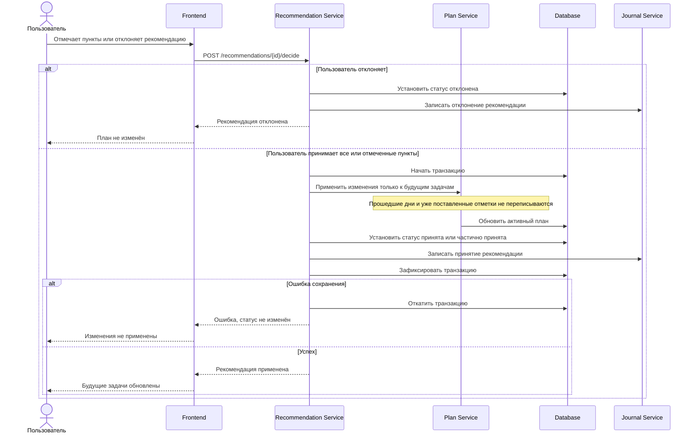

# UC-10. Подтверждение или отклонение правки

```mermaid
sequenceDiagram
    actor User as Пользователь
    participant FE as Frontend
    participant Rec as Recommendation Service
    participant Plan as Plan Service
    participant DB as Database
    participant Log as Journal Service

    User->>FE: Отмечает пункты или отклоняет рекомендацию
    FE->>Rec: POST /recommendations/{id}/decide

    alt Пользователь отклоняет
        Rec->>DB: Установить статус отклонена
        Rec->>Log: Записать отклонение рекомендации
        Rec-->>FE: Рекомендация отклонена
        FE-->>User: План не изменён
    else Пользователь принимает все или отмеченные пункты
        Rec->>DB: Начать транзакцию
        Rec->>Plan: Применить изменения только к будущим задачам
        Note over Plan: Прошедшие дни и уже поставленные отметки не переписываются
        Plan->>DB: Обновить активный план
        Rec->>DB: Установить статус принята или частично принята
        Rec->>Log: Записать принятие рекомендации
        Rec->>DB: Зафиксировать транзакцию

        alt Ошибка сохранения
            Rec->>DB: Откатить транзакцию
            Rec-->>FE: Ошибка, статус не изменён
            FE-->>User: Изменения не применены
        else Успех
            Rec-->>FE: Рекомендация применена
            FE-->>User: Будущие задачи обновлены
        end
    end
```
