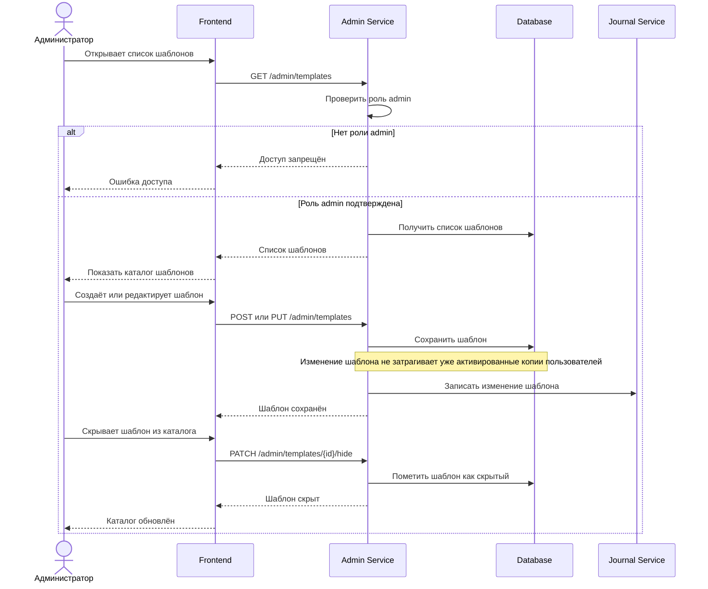

# UC-11. Ведение шаблонов администратором

```mermaid
sequenceDiagram
    actor Admin as Администратор
    participant FE as Frontend
    participant AdminSvc as Admin Service
    participant DB as Database
    participant Log as Journal Service

    Admin->>FE: Открывает список шаблонов
    FE->>AdminSvc: GET /admin/templates
    AdminSvc->>AdminSvc: Проверить роль admin

    alt Нет роли admin
        AdminSvc-->>FE: Доступ запрещён
        FE-->>Admin: Ошибка доступа
    else Роль admin подтверждена
        AdminSvc->>DB: Получить список шаблонов
        AdminSvc-->>FE: Список шаблонов
        FE-->>Admin: Показать каталог шаблонов

        Admin->>FE: Создаёт или редактирует шаблон
        FE->>AdminSvc: POST или PUT /admin/templates
        AdminSvc->>DB: Сохранить шаблон
        Note over AdminSvc,DB: Изменение шаблона не затрагивает уже активированные копии пользователей
        AdminSvc->>Log: Записать изменение шаблона
        AdminSvc-->>FE: Шаблон сохранён

        Admin->>FE: Скрывает шаблон из каталога
        FE->>AdminSvc: PATCH /admin/templates/{id}/hide
        AdminSvc->>DB: Пометить шаблон как скрытый
        AdminSvc-->>FE: Шаблон скрыт
        FE-->>Admin: Каталог обновлён
    end
```
