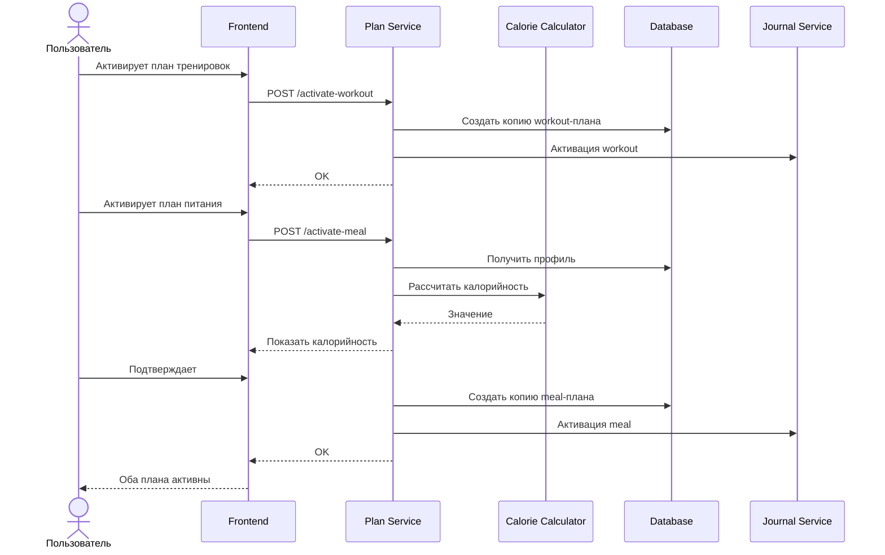
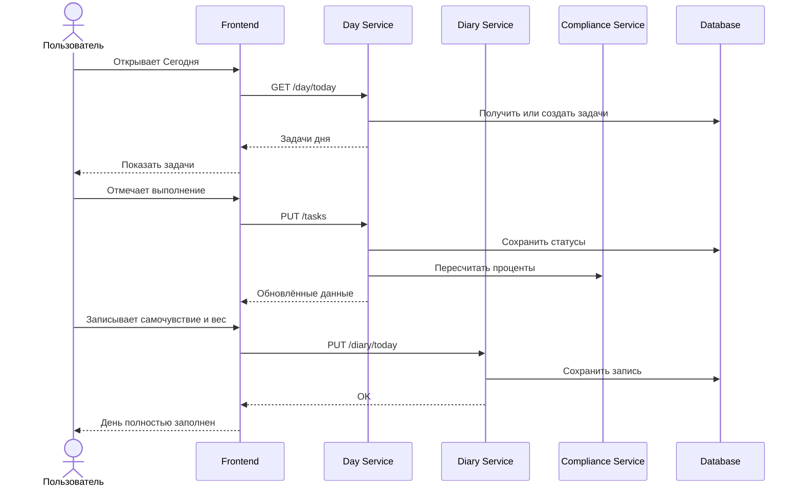

# Дополнительные полезные диаграммы

## Активация обоих планов подряд (UC-4 + UC-5)

```mermaid
sequenceDiagram
    actor User as Пользователь
    participant FE as Frontend
    participant Plan as Plan Service
    participant Calc as Calorie Calculator
    participant DB as Database
    participant Log as Journal Service

    User->>FE: Активирует план тренировок
    FE->>Plan: POST /activate-workout
    Plan->>DB: Создать копию workout-плана
    Plan->>Log: Активация workout
    Plan-->>FE: OK

    User->>FE: Активирует план питания
    FE->>Plan: POST /activate-meal
    Plan->>DB: Получить профиль
    Plan->>Calc: Рассчитать калорийность
    Calc-->>Plan: Значение
    Plan-->>FE: Показать калорийность
    User->>FE: Подтверждает
    Plan->>DB: Создать копию meal-плана
    Plan->>Log: Активация meal
    Plan-->>FE: OK
    FE-->>User: Оба плана активны
```

## Полный цикл дня (задачи + отметки + дневник)

```mermaid
sequenceDiagram
    actor User as Пользователь
    participant FE as Frontend
    participant Day as Day Service
    participant Diary as Diary Service
    participant Compliance as Compliance Service
    participant DB as Database

    User->>FE: Открывает Сегодня
    FE->>Day: GET /day/today
    Day->>DB: Получить или создать задачи
    Day-->>FE: Задачи дня
    FE-->>User: Показать задачи

    User->>FE: Отмечает выполнение
    FE->>Day: PUT /tasks
    Day->>DB: Сохранить статусы
    Day->>Compliance: Пересчитать проценты
    Day-->>FE: Обновлённые данные

    User->>FE: Записывает самочувствие и вес
    FE->>Diary: PUT /diary/today
    Diary->>DB: Сохранить запись
    Diary-->>FE: OK
    FE-->>User: День полностью заполнен
```
